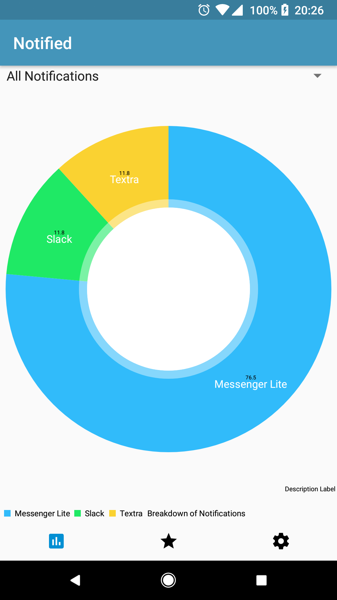

# Notified

An android app for tracking phone notifications and analyzing your notification and behavioural trends.

Created By: [Drake Morin](https://github.com/DrakeMorin) and [Jacob Steves](https://github.com/jacobsteves)

## Data Analysis
We wanted to build this as a way of getting into data analysis. Given the current buzz around big data, we thought it was a great intro to data analysis on a smaller scale. When a notification is sent, we would extract the data, categorize it, tag it and then store it in a local database. This allowed us to do some computations ahead of time, optimize performance, and effectively analyze behavioural data.

## General
- Displays the general usage information for all apps that have created notifications since Notified was installed.
- View the percentage breakdown of all notifications by sending app.
- View a breakdown of notifications received per day of the week

## App Specific Page 
- On this screen, you can view the notification data for a specific app.
- Only apps that have created notifications since Notified was installed will be shown.

## Settings
- By default energy saving mode will be enabled to minimize the impact of the app running in the background.
- Notified will also track ongoing notifications for apps like Spotify. You can disable this behaviour, but it is experimental.
- You can clear all the notification data stored whenever you want.

## Automatic Bug Reporting
- We integrated Crashlytics into our app very early on, with a goal of being able to publish our app and support it.
- Crashlytics automatically sends us a bug report and stack trace anytime the app crashes, allowing us to identify and fix bugs.

## Technologies Used
- [MPAndroidChart](https://github.com/PhilJay/MPAndroidChart) by [PhilJay](https://github.com/PhilJay)
- [Crashlytics](https://get.fabric.io/) by Fabric.io
