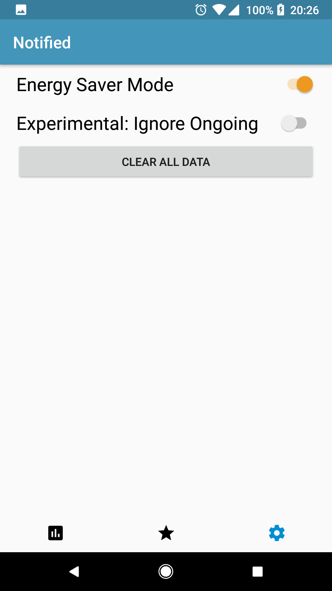

  

An Android app for tracking phone notifications and analyzing your notification and behavioural trends. The app tracks every notification your phone receives, even if the app is closed, and stores the information in a local database.
Created for UofTHacks by: [Drake Morin](https://github.com/DrakeMorin) and [Jacob Steves](https://github.com/jacobsteves)

## Data Analysis
We wanted to build this as a way of getting into data analysis. Given the current buzz around big data, we thought it was a great intro to data analysis on a smaller scale. When a notification is sent, we would extract the data, categorize it, tag it and then store it in a local database. This allowed us to do some computations ahead of time, optimize performance, and effectively analyze behavioural data.

## Getting Started
### Prerequisites
The only prerequisite to this project is the latest version of [Android Studio](https://developer.android.com/studio/index.html)

### Installation
1. Clone this repository.
2. Open the repository up in `Android Studio`.
3. From here, everything should be working. All you need to do is plug in your android device and run the app, or use the simulator within Android Studio itself.

## Demo
Main Screen                |  App Specific Screen      | Settings Screen
:-------------------------:|:-------------------------:|:-------------------------:
     |       | 

### Main Screen
- Displays the general usage information for all apps that have created notifications since Notified was installed.
- View the percentage breakdown of all notifications by sending app.
- View a breakdown of notifications received per day of the week

### App Specific Screen 
- On this screen, you can view the notification data for a specific app.
- Only apps that have created notifications since Notified was installed will be shown.

## Settings Screen
- By default energy saving mode will be enabled to minimize the impact of the app running in the background.
- Notified will also track ongoing notifications for apps like Spotify. You can disable this behaviour, but it is experimental.
- You can clear all the notification data stored whenever you want.

## Automatic Bug Reporting
- We integrated Crashlytics into our app very early on, with a goal of being able to publish our app and support it.
- Crashlytics automatically sends us a bug report and stack trace anytime the app crashes, allowing us to identify and fix bugs.

## Technologies Used
- [MPAndroidChart](https://github.com/PhilJay/MPAndroidChart) by [PhilJay](https://github.com/PhilJay)
- [Crashlytics](https://get.fabric.io/) by Fabric.io

## Versioning

We use [SemVer](http://semver.org/) for versioning. For the versions available, see the [tags on this repository](https://github.com/jacobsteves/Notified/tags). 

